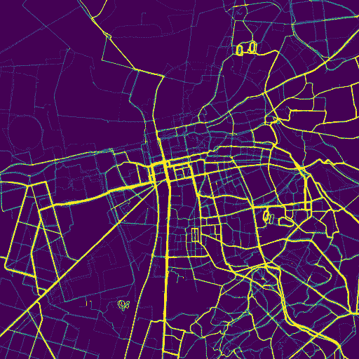

# points
draw images of gps data points

The package visualizes gps data points as an image.
On full scale, each data point is drawn as a pixel.
Depending on how many points lie on a pixel, it may
be drawn in a brighter color.
This is controlled by Contrast and the color Palette.
A blur factor takes neighbour points into account
resulting in a smearing effect. On the downside
it slows down the compuation.

This is only the package. An interactive program
can be found in gui/gui.go

The package is a fairly simple implementation which
is not optimized for speed.
It is currently good enough for a some million points,
with blur == 0.
